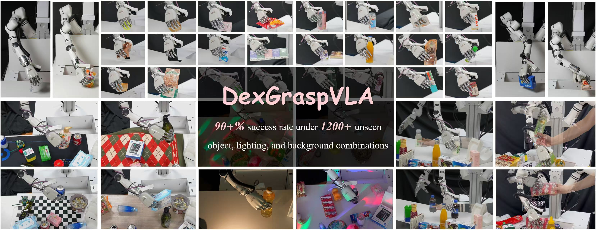

<h1 align="center"> DexGraspVLA: A Vision-Language-Action Framework Towards General Dexterous Grasping </h1>


### 📝[Paper](https://dexgraspvla.github.io/assets/paper/DexGraspVLA.pdf) | 🌍[Project Page](https://dexgraspvla.github.io/) | 📺[Video](https://www.youtube.com/watch?v=X0Sq7q-bfI8)





**DexGraspVLA** is a **hierarchical vision-language-action framework** that reaches a **90+\%** success rate in **dexterous grasping in cluttered scenes** under **thousands** of **unseen** object, lighting, and background combinations in a "**zero-shot**" real-world environment. It can also complete **long-horizon grasping tasks** that require **complex vision-language reasoning**. The framework utilizes a pre-trained vision-language model as the high-level task planner and learns a diffusion-based policy as the low-level action controller. Its key insight lies in leveraging foundation models for strong generalization and using diffusion-based imitation learning for acquiring dexterous actions.


# Environment Setup

First, please create and activate the conda environment:
```bash
conda create -n dexgraspvla python=3.9
conda activate dexgraspvla
git clone https://github.com/Psi-Robot/DexGraspVLA.git
cd DexGraspVLA
pip install -r requirements.txt
```

Then, please install [SAM](https://github.com/facebookresearch/segment-anything) and [Cutie](https://github.com/hkchengrex/Cutie) following the official instructions.

The CUDA version we use is 12.6.

# DexGraspVLA Controller

## Prepare Dataset

We provide a tiny [dataset](https://drive.google.com/file/d/1Z4QIibZwudz_qUazAGQAF7lAFAoRROnK/view?usp=drive_link) containing 51 human demonstration data samples, allowing users to understand the content and format of our data, as well as run the code to get a hands-on experience of the training process. 

First, create a `data` folder under the repo root:

```bash
[DexGraspVLA]$ mkdir data && cd data
```

Download the dataset and put it in the `data` folder. Then, decompress the dataset:

```bash
[data]$ tar -zxvf grasp_demo_example.tar.gz && rm -rf grasp_demo_example.tar.gz
```

## Launch Training

To train the DexGraspVLA controller on a single GPU, run

```
python train.py --config-name train_dexgraspvla_controller_workspace
```

To train the DexGraspVLA controller on 8 GPUs, first configure [accelerate](https://huggingface.co/docs/accelerate/index) with `accelerate config`, where we enable BF16 mixed precision training, and then run `./train.sh` or 

```
accelerate launch --num_processes=8 train.py --config-name train_dexgraspvla_controller_workspace
```

To help understand the internal model behaviors, we provide the functionality to generate, save, and visualize the attention maps of the controller. To enable this, please set `gen_attn_map` to `True` in the config file before training. During each sampling step, the attention maps will be saved as pickle files in the `train_sample_attn_maps` folder under the experiment directory. To visualize them, please run `python attention_map_visualizer.py --attn_maps_dir <path to train_sample_attn_maps>`. This will generate the images of attention maps under newly-created folders inside `train_sample_attn_maps` with the same names as the corresponding pickle files.


# DexGraspVLA Planner


We provide the code for the DexGraspVLA planner based on [Qwen2.5-VL-72B-Instruct](https://huggingface.co/Qwen/Qwen2.5-VL-72B-Instruct) in the `planner` directory. Our interface currently supports calling the API or querying a deployed model on cloud servers.

```python
# Instantiate a planner that calls the API
planner = DexGraspVLAPlanner(
    api_key="your_api_key",
    base_url="https://dashscope.aliyuncs.com/compatible-mode/v1",
    model_name="qwen2.5-vl-72b-instruct"
)

# Instantiate a planner that queries a deployed model
planner = DexGraspVLAPlanner(
    base_url="your_deployed_model_url"
)
```

# Citation

If you find our project helpful, please consider citing it as

```bibtex
@misc{zhong2025dexgraspvla,
      title={DexGraspVLA: A Vision-Language-Action Framework Towards General Dexterous Grasping}, 
      author={Yifan Zhong and Xuchuan Huang and Ruochong Li and Ceyao Zhang and Yitao Liang and Yaodong Yang and Yuanpei Chen},
      year={2025},
      eprint={2502.20900},
      archivePrefix={arXiv},
      primaryClass={cs.RO},
      url={https://arxiv.org/abs/2502.20900}, 
}
```


# Acknowledgements

This codebase is based on [Diffusion Policy](https://github.com/real-stanford/diffusion_policy), [RDT](https://github.com/thu-ml/RoboticsDiffusionTransformer), [DiT](https://github.com/facebookresearch/DiT), and [pi_zero_pytorch](https://github.com/lucidrains/pi-zero-pytorch/).
